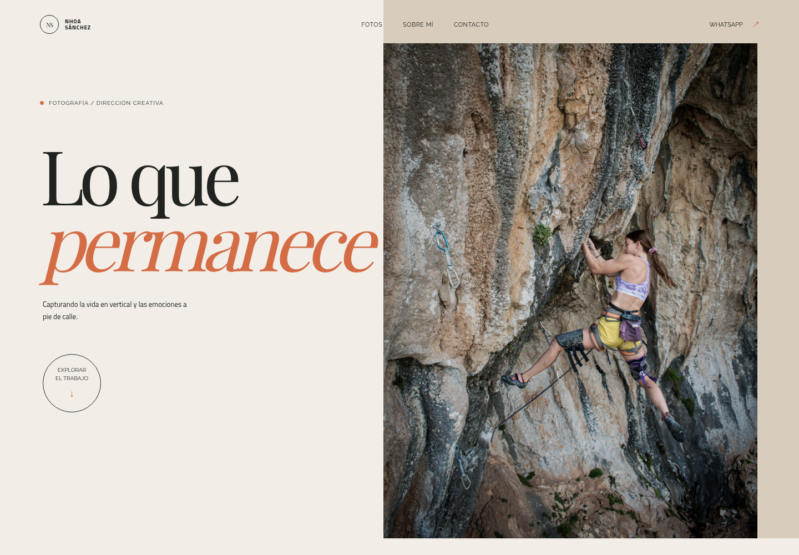
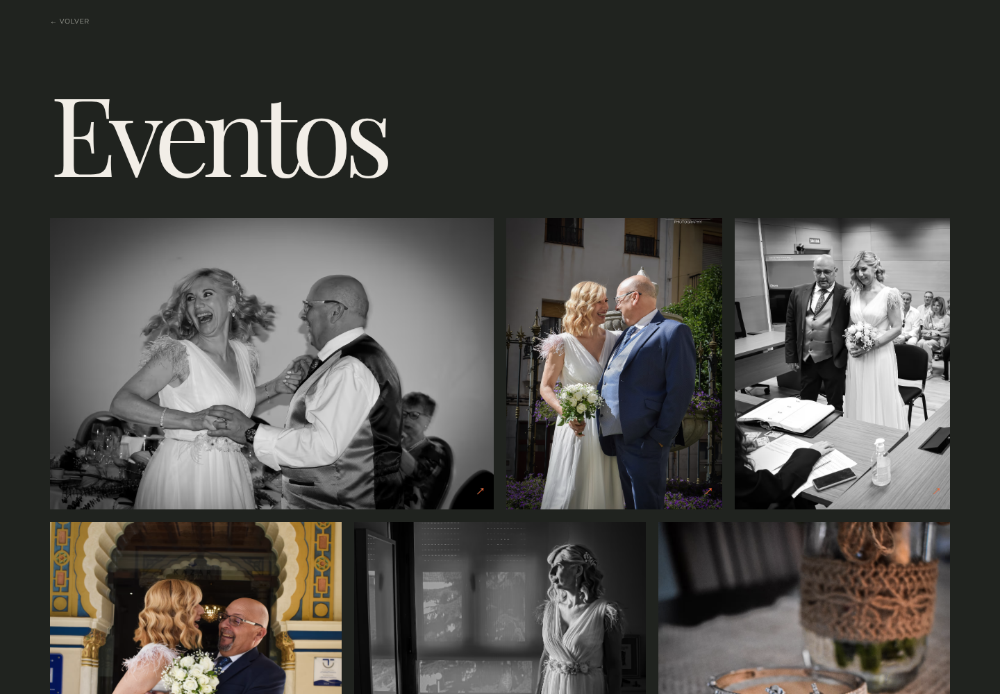
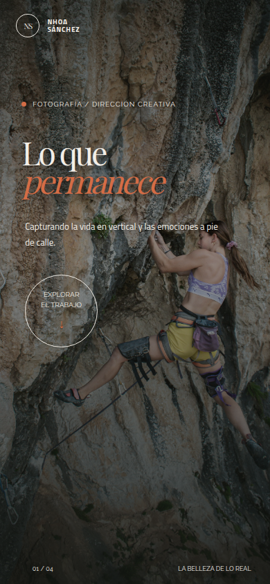
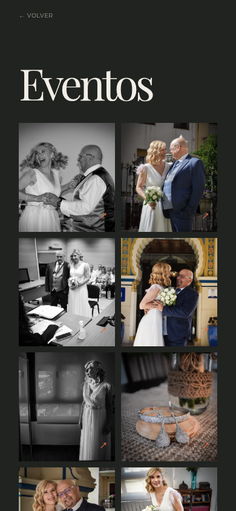

# Nhoa Sánchez | Fotografía

Portfolio fotográfico multilingüe desarrollado con Astro para Nhoa Sánchez. La experiencia combina una portada editorial, scroll horizontal controlado por scroll vertical y galerías navegables con Keen Slider.

## Demo

<video src="https://raw.githubusercontent.com/endermejia/astro-photographer/main/docs/media/nhoa-portfolio.mp4" controls muted playsinline width="100%">
  Tu navegador no puede reproducir este vídeo.
</video>

## Capturas

### Desktop





### Mobile





## Funcionalidades

- Home editorial responsive con fotografía local de alta resolución.
- Scroll vertical que desplaza horizontalmente las tarjetas de portfolio.
- Cinco galerías: Escalada, Personas, Eventos, Negocios y Viajes.
- Visor fullscreen con Keen Slider, drag táctil, flechas y teclado.
- Bento grid responsive para las galerías.
- Español como idioma principal y versión inglesa.
- SEO, sitemap y datos estructurados.
- Contacto directo por WhatsApp, email e Instagram.
- Sin manifest PWA ni opción de instalar la web como aplicación.

## Stack

- [Astro](https://astro.build/)
- [React](https://react.dev/)
- [Keen Slider](https://keen-slider.io/)
- [TypeScript](https://www.typescriptlang.org/)
- [Prettier](https://prettier.io/) y `prettier-plugin-astro`
- [Sharp](https://sharp.pixelplumbing.com/)

## Desarrollo

Requisitos: Node `24.x` y pnpm `10.12.4`.

```bash
pnpm install
pnpm start
```

La web estará disponible en `http://localhost:4321`.

## Comandos

```bash
pnpm run build
pnpm run start:prod
pnpm run lint
pnpm run lint:fix
pnpm run build:img
pnpm run test
```

## Rutas

- Home en español: `/`
- Home en inglés: `/en/`
- Álbumes en español: `/albumes/escalada/`, `/albumes/personas/`, `/albumes/eventos/`, `/albumes/negocios/`, `/albumes/viajes/`
- Álbumes en inglés: `/en/albums/climbing/`, `/en/albums/people/`, `/en/albums/events/`, `/en/albums/business/`, `/en/albums/travel/`

## Estructura

```text
src/
├── components/
│   ├── RedesignHome.astro
│   ├── Album.astro
│   ├── GalleryPage.astro
│   └── islands/AlbumLightbox.tsx
├── layouts/Layout.astro
├── pages/
├── styles/redesign.css
└── utils/photos.mjs
docs/
├── hyperframes/
├── media/
└── screenshots/
```

## Autoría

- Fotografía: [Nhoa Sánchez](https://nhoasanchez.com)
- Desarrollo: [Gabri Mejía](https://www.linkedin.com/in/gabrimejia/)
